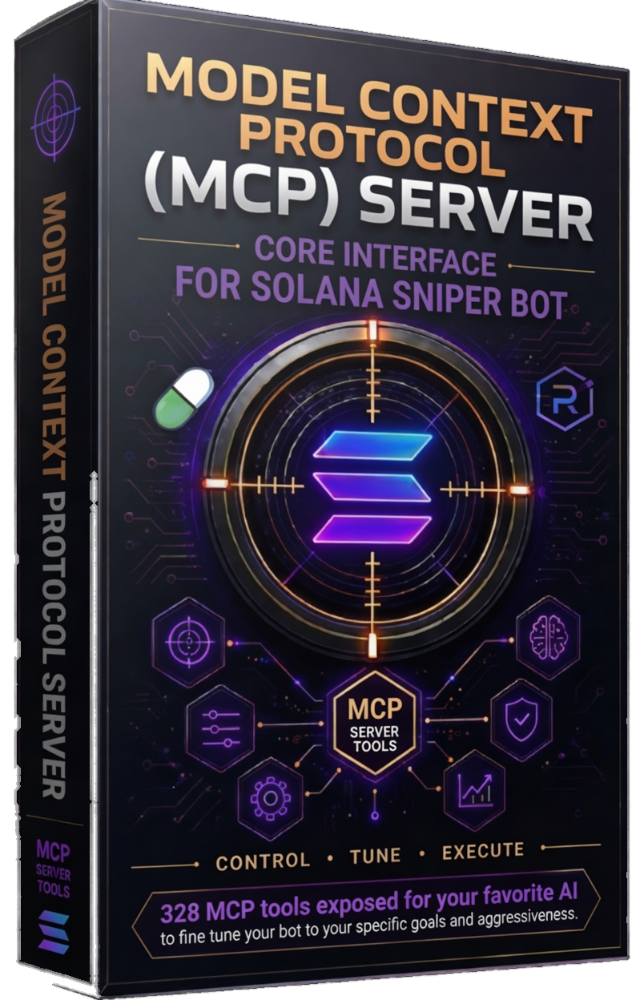

<!-- mcp-name: co.solsniperbot/solana-snipe-bot-mcp -->
# Solana Sniper Bot MCP



**Autonomous Solana trading bot with 328 MCP tools for AI-assisted control.**

Four trading modes. One Windows desktop app. Full MCP integration for Claude, Cursor, Devin, and any MCP-compatible AI assistant.

## IMPORTANT: Requires the Solana Sniper Bot Windows Application

This MCP server is **useless on its own**. It requires the **Solana Sniper Bot V4** Windows GUI application to be installed and running.

**Download the Windows executable from [solsniperbot.co](https://solsniperbot.co/download.html).**

## What It Does

The Solana Sniper Bot watches the Solana blockchain for trading opportunities across four modes:

1. **Meme / New-Token Sniping** — Pump.fun launch detection with safety/liquidity/market-cap/volume/holder/age/creator-holding filters, take-profit ladders, trailing stops, rug detection, volume-death detection, and momentum-reversal detection.

2. **Spot Trading** — Jupiter DEX aggregator integration with market/limit orders, DCA, portfolio rebalancing, risk-level presets, and slippage control.

3. **Perpetual Futures** — Long/short with leverage, margin trading, funding-rate controls, liquidation avoidance, market discovery, and signal generation.

4. **Mirror Mode** — Whale-wallet copy trading with proportional sizing, configurable limits, token filtering, and dry-run support.

Using the 328 MCP tools, your AI agent can start/stop bots, execute trades, configure safety filters, query positions and P&L, manage wallets, analyze market data, and fine-tune strategy across all four trading modes.

## Pricing

**This MCP server is 100% free.**

The Solana Sniper Bot V4 Windows application (required to use this MCP server) has the following pricing:

- **168 hours of live bot usage** (full version, no restrictions, no credit card required)
- **After trial: First month $49.99** (50% off with promo code `SOLV4FIRST50`)
- **$99.99/month** thereafter
- **Cancel anytime**

Subscribe at: [https://buy.stripe.com/dRm14ngiB5MBfIK6QM7bW07](https://buy.stripe.com/dRm14ngiB5MBfIK6QM7bW07?prefilled_promo_code=SOLV4FIRST50)

## Tools (328)

### Orderly Connection Setup (7)
- `get_orderly_setup_status` — Check locally saved Orderly credentials without revealing the private key.
- `generate_orderly_key_pair` — Generate and privately save an ED25519 pair; return only its public key.
- `lookup_orderly_account` — Look up the user's Solana Raydium Orderly account; optionally save its ID.
- `authorize_orderly_key` — Ask the running app to open wallet authorization; the user approves the signature.
- `test_orderly_connection` — Save and test the Orderly connection with current credentials.
- `copy_ai_setup_prompt` — Copy the AI setup prompt for obtaining Orderly credentials via MCP.
- `get_orderly_deposit_address` — Fetch the Orderly receiver/deposit address for the configured perp wallet.

### Bot Control (10)
- `start_bot` — Start the snipe bot (equivalent to clicking 'Start Bot' in the GUI).
- `stop_bot` — Stop the snipe bot (equivalent to clicking 'Stop Bot' in the GUI).
- `sell_all` — Panic sell — liquidate ALL open positions immediately.
- `sell_position` — Sell a single position by mint address immediately.
- `buy_mint` — Buy a specific token by mint address using configured automatic sizing.
- `get_bot_stats` — Get bot operational statistics and per-category rejection totals.
- `get_bot_status` — Get overall bot status.
- `get_pending_commands` — Get pending commands from the command queue.
- `clear_commands` — Clear the command queue.
- `close_position` — Manually close a position without executing an on-chain sell.

### Trading Mode (1)
- `set_trading_mode` — Switch between practice and live trading, matching the GUI mode button.

### RPC Pool (5)
- `get_rpc_pool_status` — List configured RPC pool slots without exposing API key values.
- `set_rpc_pool_key` — Set one Helius RPC pool key in the private local secrets.env file.
- `set_rpc_pool_skip_until` — Set or clear the skip-until date for an RPC pool slot.
- `get_rpc_pool_config` — Get the full RPC pool configuration (slots, keys masked, skip dates).
- `clear_rpc_pool_slot` — Clear (remove) the API key from an RPC pool slot.

### Configuration (8)
- `get_config` — Get the current bot configuration as JSON.
- `update_config` — Update a single config key. The bot must be restarted for some settings.
- `update_config_batch` — Validate and atomically update multiple settings from a JSON object.
- `get_config_catalog` — List every supported variable, type, range, description, and value.
- `validate_current_config` — Validate all current settings and return errors and risk warnings.
- `preview_strategy_profile` — Preview the guarded small-account profile without changing files.
- `apply_strategy_profile` — Apply the guarded profile atomically; requires confirm=true.
- `save_settings` — Save current settings to config.json.

### Positions (5)
- `get_open_positions` — Get all currently open (unsold) positions as JSON.
- `get_positions_status` — Get universal real-time position status for Meme, Perp, and Spot.
- `get_graduation_status` — Check graduation status for all open positions or a specific mint.
- `audit_open_positions` — Compare saved positions to wallet balances and live exit routes (read-only).
- `get_position_exit_quote` — Get a read-only Jupiter exit quote for a persisted open position.

### Trade History & P&L (7)
- `get_trade_history` — Get recent trade history records.
- `analyze_trade_performance` — Analyze closed-trade performance and exit-reason distribution.
- `clear_trade_history` — Clear all trade history.
- `get_pnl_tally` — Get the persistent all-time P&L tally.
- `reset_pnl_tally` — Reset the all-time P&L tally to zero.
- `refresh_pnl` — Force a P&L recompute.
- `get_fee_summary` — Get fee + ATA rent breakdown.

### Wallet & Transfers (6)
- `get_wallet_balances` — Get Funding, Meme, Savings, Perpetuals, and Spot wallet balances.
- `transfer_sol` — Transfer SOL over any directed route among the five application wallets.
- `move_all_sol` — Move all transferable SOL over any route among the five application wallets.
- `get_wallet_addresses` — Get all application wallet addresses (funding, meme, savings, perpetuals, spot).
- `get_perp_wallet_address` — Get the Perpetuals wallet address.
- `get_spot_wallet_address` — Get the Spot wallet address.

### Pulse Trends (6)
- `get_pulse_results` — Get all Pulse tab results.
- `set_pulse_match_mode` — Set the Pulse match mode.
- `clear_pulse_results` — Clear all Pulse results.
- `get_pulse_price_history` — Get price tracking for a specific mint.
- `get_pulse_purchase_preview` — Return the Pulse asset data and SOL/USD funds available for a purchase.
- `buy_pulse_asset` — Purchase a Pulse asset by SOL quantity, USD value, or available-funds percentage.

### Log & Commands (4)
- `get_log` — Get the last N lines of the bot log.
- `clear_log` — Clear the bot log file.
- `copy_log` — Copy the current bot log to the system clipboard.
- `save_log` — Save the current bot log to a file. If path is empty, saves to the project directory.

### ATA Rent (1)
- `close_empty_token_accounts` — Close all empty token accounts to reclaim ATA rent.

### Meme Bot — Safety & Filters (17)
- `set_meme_max_buy_amount` — Set the maximum buy amount in USD for meme trades.
- `set_meme_min_buy_amount` — Set the minimum buy amount in USD for meme trades.
- `set_meme_min_liquidity` — Set the minimum liquidity (USD) required for a meme token to be considered.
- `set_meme_min_market_cap` — Set the minimum market cap (USD) for a meme token to be considered.
- `set_meme_min_volume_24h` — Set the minimum 24h volume (USD) for a meme token to be considered.
- `set_meme_min_holders` — Set the minimum number of token holders required for a meme token.
- `set_meme_max_token_age` — Set the maximum token age (minutes) for meme sniping (only buy new tokens).
- `set_meme_max_creator_holdings_pct` — Set the max percentage of supply the creator/minter can hold (rug pull protection).
- `set_meme_max_positions` — Set the maximum number of simultaneous meme positions.
- `set_meme_position_size_pct` — Set the percentage of wallet to use per meme trade.
- `set_meme_slippage_bps` — Set the maximum slippage in basis points for meme swaps.
- `add_to_blacklist` — Add a token mint to the blacklist (never buy this token).
- `remove_from_blacklist` — Remove a token mint from the blacklist.
- `get_blacklist` — Return the current blacklist of token mints.
- `add_to_whitelist` — Add a token mint to the whitelist (only buy these tokens).
- `remove_from_whitelist` — Remove a token mint from the whitelist.
- `get_whitelist` — Return the current whitelist of token mints.

### Meme Bot — Exit Strategy (10)
- `set_meme_stop_loss_pct` — Set the hard stop loss percentage for meme positions.
- `set_meme_take_profit_pct` — Set the take profit percentage for meme positions.
- `set_meme_tp_ladder_steps` — Set the take-profit ladder steps (format: gain%:close_pct,gain%:close_pct).
- `set_meme_trailing_stop` — Set the trailing stop percentage for meme positions.
- `set_meme_rug_detection` — Enable or disable rug detection for meme positions.
- `set_meme_volume_death_detection` — Enable or disable volume death detection (exit when volume dies).
- `set_meme_momentum_reversal` — Enable or disable momentum reversal exit for meme positions.
- `enable_meme_stop_loss` — Enable or disable stop loss protection for meme positions.
- `enable_meme_take_profit_ladder` — Enable or disable take-profit ladder for meme positions.
- `enable_meme_trailing_stop` — Enable or disable trailing stop for meme positions.

### Meme Bot — Signals & Auto-Buy (3)
- `enable_meme_auto_buy` — Enable or disable automatic buying when signals are detected.
- `enable_meme_signals` — Enable or disable automatic signal-based buying for the meme bot.
- `clear_meme_signals` — Clear all stored Pulse signal results.

### Meme Bot — Savings & Alerts (3)
- `set_meme_auto_savings` — Enable or disable auto savings sweep for meme bot profits.
- `set_meme_savings_threshold` — Set the savings sweep threshold (USD) for the meme bot.
- `set_meme_alert_threshold` — Set the minimum Pulse buy-signal score to trigger an alert.

### Meme Bot — Analytics (16)
- `get_meme_statistics` — Return comprehensive meme trading statistics.
- `get_meme_win_rate` — Return the win rate for meme bot trading.
- `get_meme_total_pnl` — Return total realized and unrealized P&L for meme trading.
- `get_meme_best_worst_trades` — Return the best and worst meme trades.
- `get_meme_portfolio_concentration` — Return portfolio concentration analysis for meme positions.
- `get_meme_market_stats` — Return aggregate statistics across all discovered meme tokens.
- `get_meme_pulse_summary` — Return a summary of recent Pulse discovery results including top opportunities.
- `get_meme_risk_status` — Return current risk metrics for meme bot trading.
- `get_meme_signal_detail` — Return details for a specific Pulse signal by index (most recent first).
- `get_meme_position_detail` — Return details for a specific meme position by token mint.
- `get_meme_position_pnl` — Return P&L for a specific meme position.
- `get_meme_position_timeout` — Set the auto-close timeout for meme positions (0 = disabled).
- `get_meme_trade_detail` — Return details for a specific meme trade by index (most recent first).
- `get_meme_pending_graduations` — Return tokens that are pending graduation from Pump.fun.
- `get_meme_graduated_tokens` — Return tokens that have graduated from Pump.fun to Raydium.
- `get_meme_exposure` — Return total exposure across all open meme positions.

### Meme Bot — Tokens (3)
- `get_trending_meme_tokens` — Get trending/new tokens from Pump.fun and other launch sources.
- `search_meme_tokens` — Search for meme tokens by name, symbol, or mint address in Pulse results.
- `get_meme_alerts` — Return recent high-quality meme trading alerts from Pulse results.

### Meme Bot — Risk Levels (2)
- `apply_risk_level` — Atomically apply a 1-20 unified risk level; requires confirm=true.
- `preview_risk_level` — Preview one of the 20 unified risk levels without changing files.

### Meme Bot — Markets (1)
- `refresh_meme_markets` — Refresh the Meme bot markets table.

### Spot Trading — Bot Control (6)
- `start_spot_bot` — Start the spot trading bot.
- `stop_spot_bot` — Stop the spot trading bot.
- `sell_all_spot` — Panic close all open spot positions immediately.
- `get_spot_bot_status` — Return the current spot bot status (running, stopped, etc.).
- `get_spot_logs` — Return recent spot bot log lines.
- `clear_spot_logs` — Clear the spot bot log file.

### Spot Trading — Orders (6)
- `spot_market_buy` — Execute a manual market buy order for a token.
- `spot_market_sell` — Execute a manual market sell order for a token (sell all holdings).
- `spot_limit_buy` — Place a limit buy order for a token (queued for engine execution).
- `cancel_spot_order` — Cancel a pending spot order for a token.
- `close_spot_position` — Close a specific spot position by token mint.
- `get_spot_open_orders` — Return any pending spot orders.

### Spot Trading — Configuration (6)
- `get_spot_config` — Return the full spot trading configuration.
- `update_spot_config` — Update a single spot configuration field.
- `batch_update_spot_config` — Update multiple spot configuration fields at once.
- `get_spot_config_field` — Get the current value and metadata for a single config field.
- `validate_spot_config_values` — Validate the current spot configuration and return warnings.
- `get_spot_config_catalog` — Return the catalog of all available spot config fields with metadata.

### Spot Trading — Risk & DCA (10)
- `set_spot_risk_level` — Set the spot risk level (1-20) and apply the coordinated profile.
- `set_spot_max_exposure` — Set the maximum total exposure for spot trading.
- `set_spot_max_positions` — Set the maximum number of simultaneous spot positions.
- `set_spot_slippage` — Set the maximum slippage in basis points for spot swaps.
- `set_spot_dca_interval` — Set the DCA interval in seconds.
- `set_spot_dca_steps` — Set the maximum number of DCA steps per position.
- `enable_spot_dca` — Enable or disable DCA (Dollar Cost Averaging) for spot positions.
- `enable_spot_rebalancing` — Enable or disable portfolio rebalancing.
- `set_spot_rebalance_threshold` — Set the rebalancing threshold percentage.
- `set_spot_alert_threshold` — Set the minimum signal score to trigger an alert.

### Spot Trading — Positions & P&L (14)
- `get_spot_positions` — Return all open spot positions.
- `get_spot_position_detail` — Return details for a specific spot position by token mint.
- `get_spot_position_pnl` — Return P&L for a specific spot position.
- `get_spot_exposure` — Return total exposure across all open spot positions.
- `get_spot_trade_history` — Return recent spot trade history.
- `get_spot_trade_detail` — Return details for a specific trade by index.
- `get_spot_statistics` — Return comprehensive spot trading statistics.
- `get_spot_win_rate` — Return the win rate for spot trading.
- `get_spot_total_pnl` — Return total realized and unrealized P&L for spot trading.
- `get_spot_best_worst_trades` — Return the best and worst spot trades.
- `get_spot_portfolio_concentration` — Return portfolio concentration analysis for spot positions.
- `get_spot_trade_pnl_tally` — Return the aggregate P&L tally for spot trading.
- `reset_spot_pnl_tally` — Reset the spot P&L tally to zero.
- `clear_spot_trade_history` — Clear all spot trade history.

### Spot Trading — Markets & Quotes (8)
- `get_spot_markets` — Return the list of monitored spot markets with current data.
- `get_spot_market_detail` — Return detailed market data for a specific token mint.
- `get_spot_market_stats` — Return aggregate statistics across all monitored spot markets.
- `search_spot_tokens` — Search for tokens by name, symbol, or mint address via Jupiter.
- `get_trending_spot_tokens` — Get trending/popular tokens from Jupiter.
- `get_spot_quote` — Get a swap quote from Jupiter DEX.
- `get_spot_swap_transaction` — Get a serialized swap transaction from Jupiter.
- `refresh_spot_markets` — Trigger a market data refresh from Jupiter.

### Spot Trading — Signals (7)
- `get_spot_signals` — Return recent spot trading signals.
- `get_spot_signal_detail` — Return details for a specific signal by index (from most recent).
- `clear_spot_signals` — Clear all stored spot signals.
- `enable_spot_signals` — Enable or disable automatic signal generation.
- `get_spot_risk_status` — Return current risk metrics for spot trading.
- `get_spot_risk_levels` — Return all 20 spot risk levels with their names.
- `get_spot_alerts` — Return recent spot trading alerts.

### Spot Trading — Wallet & Tokens (6)
- `get_spot_wallet_balances` — Return spot wallet balances (USDC, SOL, and token holdings).
- `get_spot_token_balance` — Get a specific token balance for a wallet.
- `transfer_spot_to_savings` — Transfer funds from spot trading wallet to savings wallet.
- `add_allowed_spot_token` — Add a token to the allowed list for spot trading.
- `add_blocked_spot_token` — Add a token to the blocked list for spot trading.
- `remove_allowed_spot_token` — Remove a token from the allowed list.

### Perpetual Futures — Bot Control (8)
- `start_perp_bot` — Start the perpetuals trading bot.
- `stop_perp_bot` — Stop the perpetuals trading bot.
- `sell_all_perps` — Panic close all open perpetual positions immediately.
- `get_perp_bot_status` — Return the current perpetuals bot status (running, stopped, etc.).
- `get_perp_log` — Return the tail of the perp bot log.
- `clear_perp_log` — Clear the perp bot log file.
- `get_perp_wallet_balances` — Return the perp trading and savings wallet balances.
- `transfer_perp_sol` — Transfer SOL between trading and savings wallets.

### Perpetual Futures — Positions (6)
- `open_perp_long` — Open a long perpetual position by symbol and notional size.
- `open_perp_short` — Open a short perpetual position by symbol and notional size.
- `close_perp_position` — Close (reduce) a perp position by symbol and percentage.
- `get_perp_positions` — Return all open perpetual positions.
- `get_perp_position_detail` — Return detailed data for a specific perp position.
- `get_perp_position_pnl` — Return the P&L for a specific perp position.

### Perpetual Futures — Configuration (8)
- `get_perp_config` — Return the current perp configuration.
- `update_perp_config` — Update a single perp configuration value.
- `update_perp_config_batch` — Update multiple perp config values at once.
- `get_perp_config_catalog` — Return the catalog of all available perp config keys.
- `save_perp_settings` — Persist the current perp configuration to disk.
- `validate_perp_config_tool` — Validate the current perp configuration and return any warnings.
- `set_perp_auto_execute` — Enable or disable automatic perp order execution.
- `set_perp_dry_run` — Enable or disable perp dry-run (practice) mode.

### Perpetual Futures — Leverage & Margin (8)
- `set_perp_leverage` — Set leverage for an existing perp position or as default.
- `set_perp_max_leverage` — Set the perp max leverage cap.
- `set_perp_position_size` — Set position sizing: % of wallet as margin and max notional cap.
- `set_perp_max_exposure` — Set the perp max total exposure in USD.
- `set_perp_margin_mode` — Set perp margin mode to isolated or cross.
- `get_perp_margin_info` — Return detailed margin information for all open perp positions.
- `get_perp_margin_ratio` — Return the current perp margin ratio / health.
- `get_perp_liquidation_price` — Return the estimated liquidation price for a perp position.

### Perpetual Futures — Risk & Exits (10)
- `set_perp_stop_loss` — Set the hard stop loss percentage for perp positions.
- `set_perp_take_profit_ladder` — Set the take-profit ladder steps string (e.g. '2%:30,5%:30,10%:20').
- `set_perp_trailing_stop` — Configure the trailing stop activation and drawdown percentages.
- `set_perp_funding_exit` — Set the max adverse funding rate before the bot exits a position.
- `set_perp_liquidation_floor` — Set the minimum liquidation distance floor percentage.
- `set_perp_position_timeout` — Set the auto-close position timeout in seconds (0 = disable).
- `set_perp_direction` — Set allowed trade directions: 'long', 'short', or 'both'.
- `set_perp_auto_savings` — Configure auto savings sweep for perp profits.
- `get_perp_exposure` — Return total perp exposure and margin usage summary.
- `get_perp_risk_status` — Return the current perp risk status (leverage, exposure, etc.).

### Perpetual Futures — Market Filters (6)
- `set_perp_market_filters` — Set market entry filters: min 24h volume, min open interest, max spread.
- `set_perp_allowed_tokens` — Set the comma-separated list of allowed base tokens (empty = all allowed).
- `set_perp_blocked_tokens` — Set the comma-separated list of blocked base tokens (never trade these).
- `set_perp_signal_mode` — Set the perp signal generation mode.
- `enable_perp_signal` — Re-enable signal generation for a blocked perp market.
- `disable_perp_signal` — Disable signal generation for a perp market.

### Perpetual Futures — Orders (9)
- `set_perp_order_type` — Set the default perp order type: MARKET, LIMIT, POST_ONLY, IOC, or FOK.
- `set_perp_slippage` — Set the max acceptable slippage in basis points for perp orders.
- `set_perp_poll_intervals` — Set polling intervals for market data, position monitoring, and signals.
- `set_perp_testnet` — Switch perp API between testnet and mainnet.
- `cancel_all_perp_orders` — Cancel all open perp orders, optionally filtered by symbol.
- `cancel_perp_order` — Cancel a specific perp order by order ID.
- `modify_perp_order` — Modify an existing perp order's price and/or size.
- `get_perp_open_orders` — Return all open perp orders.
- `get_perp_order_history` — Return recent perp order history.

### Perpetual Futures — Markets & Data (9)
- `get_perp_markets` — Return the list of available perpetual markets.
- `get_top_perp_markets` — Return top perp markets sorted by volume, open interest, or 24h change.
- `search_perp_markets` — Search perp markets by symbol substring with optional volume/leverage filters.
- `get_perp_market_detail` — Return detailed data for a specific perp market.
- `get_perp_market_stats` — Return aggregate statistics across all perp markets.
- `get_perp_candles` — Return recent candle (kline) data for a perp market.
- `get_perp_orderbook` — Return the latest orderbook snapshot for a perp market.
- `get_perp_price_changes` — Return multi-timeframe price changes for all perp markets.
- `refresh_perp_markets` — Refresh the Perpetuals bot markets table.

### Perpetual Futures — P&L & Analytics (14)
- `get_perp_pnl_tally` — Return the all-time perp P&L tally.
- `reset_perp_pnl_tally` — Reset the all-time perp P&L tally to zero.
- `get_perp_trade_history` — Return perp trade history.
- `get_perp_trade_detail` — Return details for a specific perp trade by its index in history.
- `clear_perp_trade_history` — Clear the perp trade history file.
- `get_perp_fee_summary` — Return a summary of fees paid across all perp trades.
- `refresh_perp_pnl` — Force a refresh of the perp P&L tally from trade history.
- `analyze_perp_performance` — Analyze perp trade performance and return summary stats.
- `get_perp_funding_cost` — Return total funding payments paid/received for a position or all.
- `get_funding_rates` — Return current funding rates for all perp markets.
- `get_funding_history` — Return recent funding payment history for a perp market.
- `get_liquidations` — Return recent large liquidation events.
- `get_perp_correlation_matrix` — Return a simple correlation matrix between open perp positions.
- `get_perp_var_estimate` — Return a simple parametric VaR estimate for open positions.

### Perpetual Futures — Signals (5)
- `get_perp_signals` — Return the latest perp trading signals.
- `get_perp_signal_detail` — Return details for a specific perp signal.
- `get_perp_signal_summary` — Return a summary of signal generation stats (counts by type, direction).
- `get_perp_signal_history` — Return the history of past perp signals (executed and rejected).
- `clear_perp_signal_history` — Clear the perp signal history file.

### Perpetual Futures — Risk Levels (2)
- `apply_perp_risk_level` — Apply a risk level (1-20) to the perp configuration.
- `preview_perp_risk_level` — Preview the perp configuration for a specific risk level (1-20).

### Perpetual Futures — Wallet (3)
- `refresh_perp_wallet_balances` — Refresh the Perpetuals wallet balances display.
- `fund_perp_wallet` — Transfer SOL from the funding wallet to the perpetuals wallet.
- `swap_perp_sol_to_usdc` — Swap all SOL in the perpetuals wallet to USDC via Jupiter.

### Mirror Mode — Whale Management (6)
- `add_mirror_whale` — Add a whale wallet to monitor. Mode: spot, perp, or both.
- `remove_mirror_whale` — Remove a whale wallet from monitoring.
- `toggle_mirror_whale` — Enable or disable a whale wallet for mirror trading.
- `get_mirror_whales` — Return the list of all monitored whale wallets.
- `get_mirror_whale_stats` — Return performance stats for a specific whale.
- `get_all_mirror_whale_stats` — Return performance stats for all monitored whales.

### Mirror Mode — Configuration (9)
- `get_mirror_config` — Return the full mirror trading configuration.
- `update_mirror_config_field` — Update a single mirror configuration field.
- `set_mirror_mode` — Set mirror mode: 'spot', 'perp', or 'both'.
- `set_mirror_allocation_pct` — Set the percentage of wallet allocated to mirror trading.
- `set_mirror_copy_sells` — Enable or disable copying whale sell trades (not just buys).
- `set_mirror_dry_run` — Enable or disable dry-run mode for mirror trading.
- `set_mirror_max_trade_usd` — Set the maximum USD per mirrored trade.
- `set_mirror_stop_loss_pct` — Set the stop loss percentage for mirror positions.
- `set_mirror_take_profit_pct` — Set the take profit percentage for mirror positions.

### Mirror Mode — Positions & Trades (6)
- `get_mirror_trades` — Return recent mirror trade history.
- `clear_mirror_trade_history` — Clear all mirror trade history.
- `sell_all_mirror_positions` — Close all mirror positions immediately.
- `get_mirror_bot_status` — Return the current mirror bot status and statistics.
- `start_mirror_bot` — Start the mirror trading bot (copy whale trades).
- `stop_mirror_bot` — Stop the mirror trading bot.

### Technical Indicators (8)
- `get_all_indicators` — Get all technical indicators for a token in one call.
- `get_rsi` — Calculate RSI for a token based on recent candle data.
- `get_macd` — Calculate MACD for a token.
- `get_moving_averages` — Calculate SMA and EMA for a token.
- `get_bollinger_bands` — Calculate Bollinger Bands for a token.
- `get_atr` — Calculate ATR (Average True Range) for a token.
- `get_volume_analysis` — Analyze volume patterns for a token.
- `get_token_candles` — Get OHLCV candlestick data for a token.

### Market Data (5)
- `get_token_market_data` — Get aggregated market data for a token (price, volume, change).
- `get_token_price` — Get the current USD price of a token.
- `get_token_prices` — Get USD prices for multiple tokens (comma-separated mints).
- `get_sol_price` — Get the current SOL price in USD.
- `get_signal_summary` — Return a summary of recent signals by type and strength.

### Alert Sounds — Meme Bot (5)
- `set_use_sounds` — Enable or disable all Meme bot alert sounds.
- `set_buy_alert_sound` — Set the Meme bot buy alert sound file path.
- `set_sell_alert_sound` — Set the Meme bot sell alert sound file path (WAV/MP3/AAC/M4A/WMA/OGG).
- `set_win_alert_sound` — Set the Meme bot win alert sound file path (played 5s after a profitable close).
- `set_loss_alert_sound` — Set the Meme bot loss alert sound file path (played 5s after a losing close).

### Alert Sounds — Perpetuals Bot (5)
- `set_perp_use_sounds` — Enable or disable all Perpetuals bot alert sounds.
- `set_perp_buy_alert_sound` — Set the Perpetuals bot buy alert sound file path.
- `set_perp_sell_alert_sound` — Set the Perpetuals bot sell alert sound file path.
- `set_perp_win_alert_sound` — Set the Perpetuals bot win alert sound file path.
- `set_perp_loss_alert_sound` — Set the Perpetuals bot loss alert sound file path.

### Alert Sounds — Spot Bot (5)
- `set_spot_use_sounds` — Enable or disable all Spot bot alert sounds.
- `set_spot_buy_alert_sound` — Set the Spot bot buy alert sound file path.
- `set_spot_sell_alert_sound` — Set the Spot bot sell alert sound file path.
- `set_spot_win_alert_sound` — Set the Spot bot win alert sound file path.
- `set_spot_loss_alert_sound` — Set the Spot bot loss alert sound file path.

### Alert Sound Actions (2)
- `play_alert_sound` — Play/test an alert sound. bot: 'meme'|'perp'|'spot'. sound_type: 'buy'|'sell'|'win'|'loss'.
- `get_alert_sound_paths` — Get all configured alert sound paths for all three bots.

### Wallet Operations (2)
- `swap_sol_usdc` — Swap SOL to USDC or USDC to SOL in a wallet via Jupiter.
- `buy_sol_with_card` — Get the MoonPay on-ramp URL for buying SOL with a card.

### PlayMoney (Simulated Balances) (2)
- `set_playmoney_balance` — Set the simulated (PlayMoney) balance for a wallet. Only works in practice mode.
- `reset_playmoney_balances` — Reset all PlayMoney (simulated) balances to zero.

### License & Membership (3)
- `get_membership_status` — Get the current membership/trial status (trial hours remaining, licensed, expired).
- `activate_license` — Activate a license key to unlock full membership.
- `refresh_membership_status` — Re-check membership/trial status from the license server.

### Market Refresh (1)
- `refresh_spot_wallet_balances` — Refresh the Spot wallet balances display.

### In-App Browser (1)
- `open_in_app_browser` — Open a URL in the in-app Chromium browser routed through a European proxy.

### GUI View Switching (1)
- `switch_bot_view` — Switch the GUI to a different bot view.

### About & Info (1)
- `get_about_info` — Get application version, MCP tool count, and about information.

## Installation

```bash
pip install solana-snipe-bot-mcp
```

## Client Configuration

```json
{
  "mcpServers": {
    "solana-snipe-bot": {
      "command": "python",
      "args": ["-m", "solana_snipe_bot_mcp"],
      "env": {
        "SOLANA_SNIPER_BOT_DIR": "/path/to/snipe-bot"
      }
    }
  }
}
```

## Links

- **GitHub:** [https://github.com/solara-sniper-bot/MCP](https://github.com/solara-sniper-bot/MCP)
- **Website:** [https://solsniperbot.co/](https://solsniperbot.co/)
- **Download:** [https://solsniperbot.co/download.html](https://solsniperbot.co/download.html)
- **MCP Landing Page:** [https://solsniperbot.co/mcp/](https://solsniperbot.co/mcp/)
- **PyPI:** [https://pypi.org/project/solana-snipe-bot-mcp/](https://pypi.org/project/solana-snipe-bot-mcp/)
- **MCP Registry:** `co.solsniperbot/solana-snipe-bot-mcp`
- **Smithery:** [https://smithery.ai/servers/mcleer-michael/solana-snipe-bot-mcp](https://smithery.ai/servers/mcleer-michael/solana-snipe-bot-mcp)
- **Subscribe (app):** [https://buy.stripe.com/dRm14ngiB5MBfIK6QM7bW07](https://buy.stripe.com/dRm14ngiB5MBfIK6QM7bW07?prefilled_promo_code=SOLV4FIRST50)

## License

MCP server: MIT (free). The Solana Sniper Bot V4 Windows application is proprietary — membership required for live trading after the 7-day trial. Use at your own risk. On-chain trading is risky.
